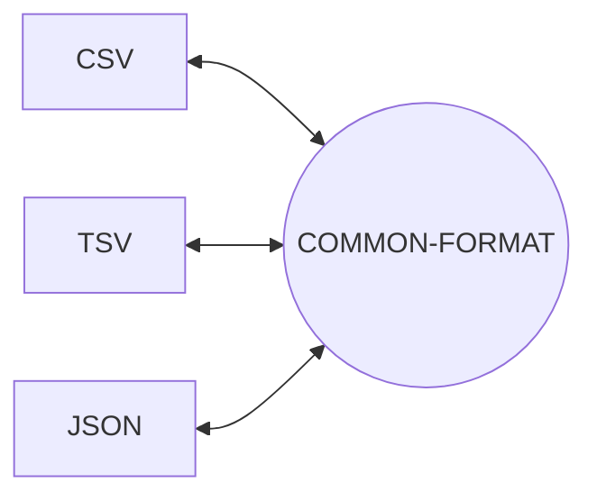

# SISO
A highly scalable and modular data parser designed to be easy to use and install

## Table of contents:

[What really is SISO?](#What-really-is-SISO?)

[Installation](#Installation:)

[Contributions:](#Contributions)

[How it works:](#How-it-works)

[Made by:](#Made-by)

## What really is SISO?

SISO is a highly modular data open source data parsing solution. It is designed to allow conversion of data from one format to another.

Created as part of a **Staffordshire University** project.

## Installation:

Current installation instructions pending.

Hopefully going to make it a .deb! Hence the project structure.

## Contributions:

All contributions are welcome.

## How it works:

The GO code converts data from a given format into an intermediate format then to a selected formate for example:

As illustrated by the diagram as long as the data can be converted into the common format then it can be turned into any of the output modules.

To achieve this the GO program is split into 3 stages:

1. Convert Incoming data to the common format of []interface{}
2. Apply any simple filtering techniques as shown in the example filter folder.
3. Convert from common format into chosen format.

## Made by:
Wes